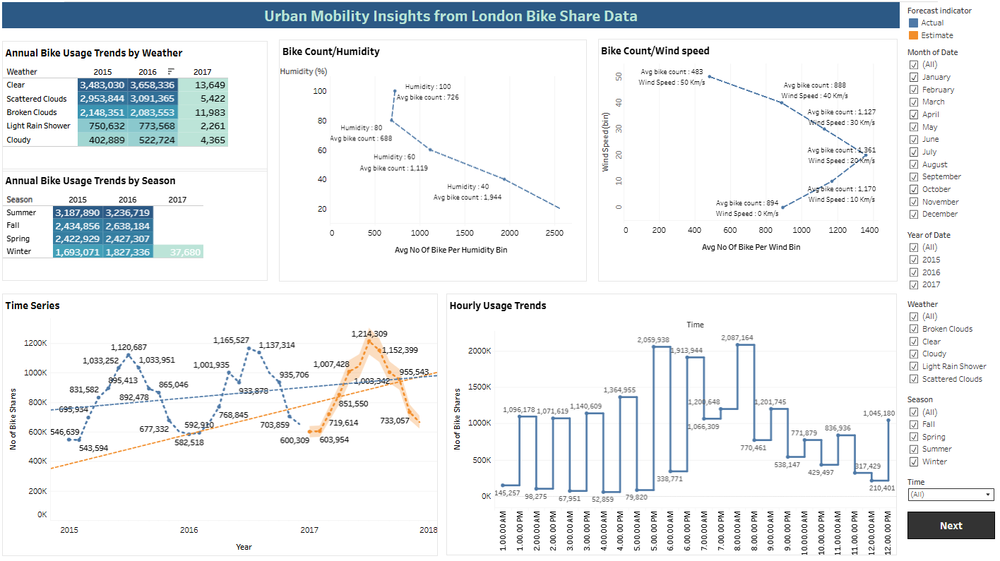
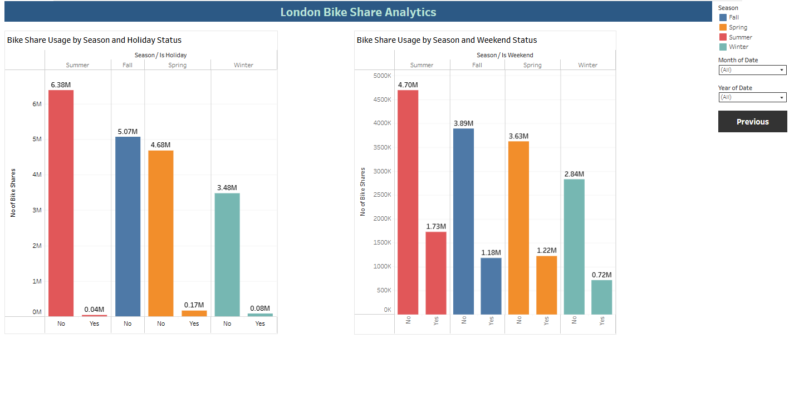

# 🚴‍♂️ London Bike Share Data Cleaning and EDA Project

How can data analytics on London’s bike-sharing system inform business decisions regarding maintenance schedules, demand-based pricing, and promotional strategies ?

This project delves into how environmental elements like weather, humidity, and wind, along with temporal aspects such as the season, time of day, weekdays versus weekends, and holidays, influence bike usage patterns in London. The goal is to provide valuable insights that can inform inform business decisions regarding maintenance schedules, demand-based pricing, and promotional strategies.

---

## Business Use Cases / Applications :
- Time-specific promotions (“Weekend Ride Discount” or “Summer Pass Offers”)
- Workforce planning, Maintenance & redistribution
- Urban planning, Better station placement
- Demand-Based Pricing (pricing strategies based on time, weather, and holiday patterns)
- Identify periods of low usage (perform maintenance with minimal disruption to users)

---

## 📌 Project Highlights

- ✅ Cleaned and preprocessed a daily bike-share dataset.
- 🧹 Addressed missing values, outliers, and improper data types.
- 📊 Performed exploratory data analysis (EDA).
- 📅 Engineered new time-based features from date.
- 📈 Visualized key trends and distributions.

---

## 🗂️ Dataset Information

- **Source**: [Kaggle - London Bike Sharing Dataset](https://www.kaggle.com/hmavrodiev/london-bike-sharing-dataset)
- **Records**: Daily entries from 2015 to 2017.
- **Columns**:
  - `timestamp`, `cnt` (bike count), `t1` (real temp), `t2` (feels like), `hum`, `wind_speed`, `weather_code`, `is_holiday`, `is_weekend`, `season`, etc.

---

## 🧰 Tools & Libraries

- **Python**
- `pandas`
- `numpy`
- `matplotlib`
- `seaborn`

---

## 🔍 Data Cleaning & Processing Steps

1. **Initial Inspection**
   - Loaded data with Pandas
   - Displayed data types, head, tail, and summary stats

2. **Datetime Handling**
   - Converted `timestamp` to `datetime`
   - Created `year`, `month`, `day`, and `weekday` columns

3. **Missing Values**
   - Checked and verified presence/absence of `NaN`s

4. **Data Type Conversion**
   - Ensured proper types for numerical and categorical columns

5. **Outlier Detection**
   - Used boxplots and statistical thresholds to identify outliers

6. **EDA (Exploratory Data Analysis)**
   - Visualized trends over time
   - Plotted correlations between temperature, humidity, and bike usage

---

## 📊 Key Visualizations

- Distribution of bike rentals across seasons and weather conditions
- Line plots showing trends by month and weekday
- Correlation heatmaps between features

---

## 📌 Insights & Observations

- 📈 Bike usage is **highest during spring and summer**, lowest in winter.
- ❄️ **Humidity and wind** tend to negatively correlate with bike rentals.
- ☀️ Warmer temperatures encourage more rentals, as expected.
- 🧾 **Weekends and holidays** have different usage patterns compared to weekdays.
- 📊 Certain features (e.g., weather code, temperature) are strong predictors of bike demand.
